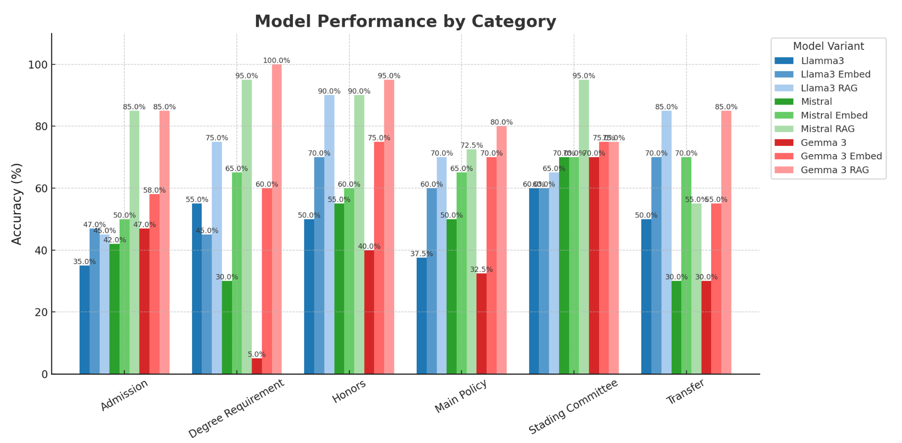

# NYU Academic Advisor Chatbot

An open-source project that builds a specialized academic advising assistant for NYU College of Arts and Science (CAS), leveraging Retrieval-Augmented Generation (RAG), finetuning, and prompt embedding on domain-specific documents.

## Overview

Students at NYU CAS often face delays or obstacles accessing timely academic advising. General-purpose LLMs struggle to provide reliable, context-aware guidance on institutional policies. Our solution introduces a **specialized chatbot** that utilizes Retrieval-Augmented Generation (RAG), fine-tuning, and prompt-based embedding to offer accurate, fast, and low-cost support for students.

##  Architecture

- **Backend LLMs**: Open-source models with long-context support (LLaMA3, Mistral, Gemma)
- **Knowledge Base**: Over 40,000 tokens of curated NYU policy documents and synthetic QA pairs
- **Methods Evaluated**:
  - Baseline (Vanilla LLM)
  - LoRA Fine-tuning
  - Prompt Embedding  
  - RAG
- **Embedding Models**: BGE-Large, with exploration of OpenAI and Jina embeddings

## Key Findings

| Method       | Strengths                        | Weaknesses                          |
|--------------|----------------------------------|-------------------------------------|
| **LoRA**     | Fast inference, works offline    | Poor MCQ performance, poor scoring  |
| **Embedding**| Better answer relevance          | Similarity metrics can mislead      |
| **RAG**      | Strong improvement in QA tasks   | Retrieval failures when chunk not ranked top-k |

## Experiment Configuration

- **LoRA Setup**:
  - Rank: 8, α: 16, Dropout: 0.05
  - Learning Rate: 2e-4, Epochs: 3
- **RAGFlow Setup**:
  - Chunk size: 512 tokens
  - Retrieval: Weighted keyword + cosine similarity
  - Threshold: 0.2, Top-N: 8

##  Evaluation

Performance was assessed using:
- Multiple-Choice Question (MCQ) evaluations
- BertScore similarity
- GPT-4o-based grading for finetuned models

## ️ Results

### Overall Performance:

### Fine-tunded:

### Rag:

##  Limitations

- Finetuning focuses on generation over classification
- BertScore is blind to semantic errors with high lexical overlap
- Current RAG similarity scores are too close

##  Future Work

- Investigate **why finetuning underperforms** despite task alignment
- Develop **advanced evaluation metrics** (semantic understanding, contradiction detection)
- Deploy better **embedding models** and reranking strategies
- Expand to **other advising domains** (e.g., GSAS, Tandon)

##  Authors

- David Dai  
- Keven Ni  
- Kelly Lin  
